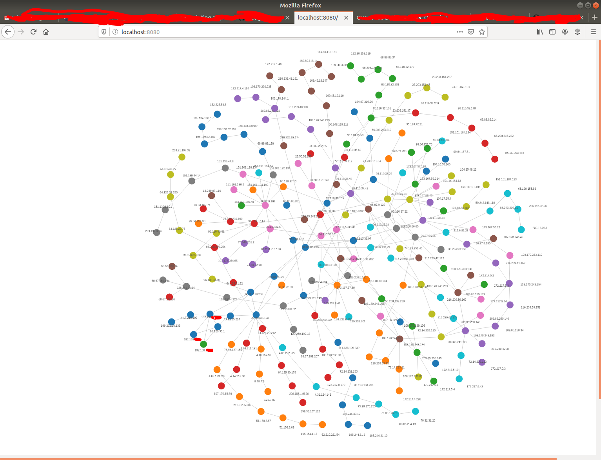
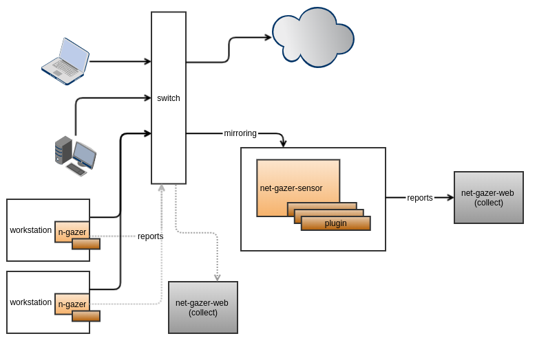
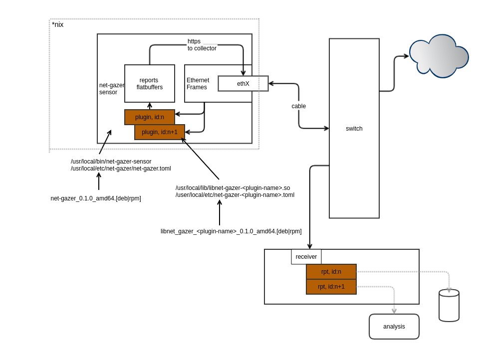

# "_net-gazer_" - network connection capture and analysis daemon 

## Goals
Design daemon, capable of intercepting traversing ethernet frames from network interface. Daemon should be able to load plugins for specialized packet processing. Plugins will be sending inspection reports via host daemon provided facilities. For deployment, daemon will be deployed to endponts, such as gateway, switch spanning ports and workstations

Plugins can use captured data for:
+ network performace monitoring
+ communication visualization
+ statistical analysis
+ host/network security
+ many other things

## my experiments
+ [traceroute: VPN box, with no VPN server running](./docs/use-case-vpn-host-with-no-vpn-running.md) 
+ [all ipv4 plugin: VPN box](./docs/use-case-with-all-ipv4-plugin.md) 


<br/>

## other components
 data-collector part..   
 example pluging   
 - captures SYN+SYN/ACKs and traces tcp connection destination (just for fun) and profides graphed data, that can be visualised    
 - captures all ipv4 pakets


## TODOs
+ geoiplocation - move to another process
+ traceroute  
  + udp
  + icmp
  + tcp

## Graphed http sessions, originated from browser



## Deployment



## Architecture



## Components
1. [net-gaser-sensor](https://github.com/soleinik/net-gazer-sensor)
2. net-gazer-plugins
  * [demo](https://github.com/soleinik/net-gazer-plugin-demo)  
  * [traceroute](https://github.com/soleinik/net-gazer-plugin-traceroute)  
  * [all ipv4 plugin](https://github.com/soleinik/net-gazer-plugin-all-ipv4)  

3. collector [net-gazer-web](https://github.com/soleinik/net-gazer-web)
4. redisgraph db [docker-compose](https://github.com/soleinik/net-gazer-web/blob/master/docker-compose.yml)


## how I run it...

1. build net-gazer-sensor 
```
$ cargo deb
```
install [cargo-deb](https://crates.io/crates/cargo-deb) as 
```
$ cargo install cargo-deb
```
2. install net-gazer-sensor (plugins deb is configured for dependency on net-gazer)
``` 
# dpkg -i ./target/debian/net-gazer_0.1.0_amd64.deb
```
3. stop daemon (b/c we will run it from cli)
```
# systemctl stop net-gazer
```
4. build plugin (from plugin repo build deb and install with dpkg)

5. build and run net-gazer-web
```
$ cargo run
```
6. with docker-compose bring up redisgraph 
```
$ docker-compose up
```
7. run net-gazer-sensor (it will discover deployed plugin)
```
$ cargo run -- -vv
```
8. Create some network traffic 

9. I use "redisinsight" to check graph (cypher query)
```
MATCH (n:hop) return n
```
to see 5 "neighbour" hopes
```
MATCH (a:hop{ip:'192.168.<your>.<ip>'})-[next*1..5]->(ancestors) RETURN a, ancestors
```
10. to remove everything (ofter done)
```
# apt-get purge net-gazer
```


## To run (cli help)
root is needed to run (./.cargo/config)
```
$ cargo run [-- --help]

$ cargo run -- -i eth0 -v

```

## Configuration file search order
```
./etc/net-gazer/net-gazer.toml
/usr/local/etc/net-gazer/net-gazer.toml
/etc/net-gazer/net-gazer.toml
```

## Help
```
cargo run -- --help

Running `sudo -E target/debug/net-gazer --help`
net-gazer 0.1.0
network connection capture and analysis daemon

USAGE:
    net-gazer [FLAGS] [OPTIONS]

FLAGS:
    -h, --help         Prints help information
    -V, --version      Prints version information
    -v, --verbosity    Verbose mode (-v(info), -vv(debug), -vvv(trace), etc.)

OPTIONS:
    -c, --config <config-path>    configuration file [env: NG_CONFIG=]
    -i, --iface <iface>           target network interface [env: NG_IFACE=]
