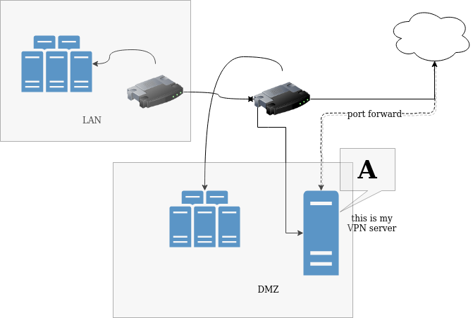

## VPN box with no VPN Server running

# Network diagram

# setup
"A" is my VPN box, with no VPN server running... This box is accessible from outside via port forwarding. With VPN, (right or wrong), this box serves as ssh jumping host. This host is accesible from inside the network, via ssh and lxc console.

# question
Should there be any traffic?

# net-gazer setup
1. net-gazer-sensor sniffs traffic from 'eth0' nic and sends reports via 'lo'
2. all-ipv4 plugin deployed to net-gazer-sensor
3. net-gazer-web runs on that(for simplicity) box, on 'lo' nic. There is not db running, but transaction log, that I will replay later into database

# notes
Immediatelly - there is much more activity... I will shutdown my VPN server and see now plugin behaves with scans and etc...
OK, one mistery solved - I'm connected with ssh to that box... so, need to add some filtering to plugin. For now, will use "lxc-attach"...
